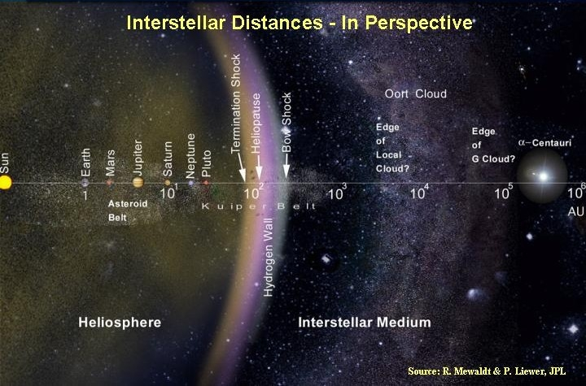

# Solar-polar

## How to remember the planets:

```
my very easy method, just say: "uckie noodles please"
```
# Each first letter is the first letter of a planet it will jog your memory every time
Reminds you that the (main) planets are:
```
mercury, venus, earth, mars, jupiter, saturn, uranus, neptune and pluto
```

## Scaling the planets

Now for the code project we need to know how fast they go, so we can scale the planets

## Days in a year

Planet | Days in a year
--- | ---: 
mercury | 88
venus | 225 
earth | 365.25
mars | 687
jupiter | 4,300
saturn | 11,000
uranus | 31,000
neptune | 60,200
pluto | 90,500

## The definition of a year is how long it takes to get round Sol

Scale by multiplying standard orbit by `number of days in an earth year / number of days in a year`

## See my reprisentation of the planets

[My planets](https://mewhubhawk.github.io/Solar-polar/)



# FACTS!

## What is the true colour of the sun?

If you ask someone who knows a bit about astronomy will tell you that the
sun belongs to a catergory of stars known as 'Yellow Dwarfs' so it's ok to 
assume it is yellow?

No, like all yellow dwarf stars, the sun is COMPLETELY white.

### So why do human eyes see it as yellow?

it's because of earth's atmosphere, light that has a long 
wavelength in the yellow and red part of the spectrum passes 
through the atmosphere best of all.
light whith shorter wavelengths, in the green to violet spectrum 
(which the sun mostly emits) gets dissipated to a greater degree
by the atmosphere.
The effect of this is to make the sun seem yellow!

## Is the Earth perfectly spherical?

it might have been once but not now because the Earth is changing
shape due to constant movement of the contental plates though the 
rate of it actually moving is tiny. However this still has made an 
effect on the shape of the Earth which is far from perfectly round.


